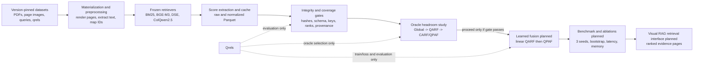

# PROJECT_OVERVIEW.md

## 1. Problem Statement

Visual-document retrieval is a critical stage of a Visual Retrieval-Augmented Generation (Visual RAG) system. Given a natural-language query, the retriever must rank pages containing evidence for a downstream reader or answer generator. Relevant pages may be identifiable through exact words, semantic paraphrases, charts, tables, layout, or other visual signals. No retrieval channel is consistently strongest across all queries or candidate pages.

This project investigates **Query-Page-Adaptive Fusion (QPAF)**, a lightweight reranking layer that combines three frozen retrieval signals:

- BM25 lexical scores over extracted document text;
- BGE-M3 dense-text similarity scores; and
- ColQwen2.5 visual page-retrieval scores.

The central research question is whether the useful contribution of each channel varies at the query-page level. A global fusion uses one weight vector for all queries; Query-Adaptive Retrieval Fusion (QARF) uses one vector per query; Candidate-Cluster-Adaptive Retrieval Fusion (CARF) uses one vector per label-free candidate cluster; QPAF uses one vector per query-page pair. The project is deliberately falsifiable: if query-level or static fusion captures the available gain, the simpler method should be selected rather than assuming that page-level adaptation is beneficial.

The repository contains validated data and score contracts, score extraction, Global/QARF/QPAF oracle analysis, a resumable post-hoc oracle wrapper, and non-training tests. It does **not** yet contain a learned QPAF implementation or deployable QPAF result. The original Phase 1 ViDoSeek pilot, P1-02, remains blocked because its frozen top-K protocol left one query without a relevant candidate after the permitted expansion. A separate all-corpus recovery, P1-02R, has a verified score bundle but does not convert P1-02 into a pass.

## 2. Real-World Relevance

The intended use case is evidence retrieval from visually complex PDF collections such as financial reports, slide decks, technical documents, and mixed-layout archives. Target stakeholders include retrieval engineers, Visual RAG researchers, ML platform engineers, and technical product owners responsible for search quality and reproducibility.

If successful, QPAF would sit between frozen retrievers and a downstream answer-generation system. It would rerank an existing candidate set without fine-tuning the retrievers, allowing the system to emphasize lexical, semantic, or visual evidence differently for each candidate page. The expected impact is improved evidence ranking with a measurable latency and memory envelope. A negative result is also actionable: it would justify deploying fixed fusion or QARF and avoiding unnecessary page-level complexity.

This repository evaluates retrieval, not end-to-end answer correctness. Generation quality, production throughput, user satisfaction, and business return remain outside the evidence boundary: `[INSERT: downstream Visual RAG product evaluation plan]`.

## 3. System Architecture

Dataset and model revisions are pinned in configuration and manifests. GPU score extraction and any future optimizer steps are restricted to Modal; the local Windows environment is used for documentation, manifest/schema verification, cached-score analysis, and deterministic non-training tests. Candidate construction, normalization, and inference features must not read qrels. Qrels enter only the explicitly declared coverage, oracle, training-loss, and evaluation stages.

The oracle layer is an upper-bound diagnostic, not a deployable model. It searches a preregistered simplex of fusion weights using relevance labels to measure whether progressively finer adaptation has enough headroom to justify implementation. The planned learned layer replaces label-driven weight selection with a small predictor based on label-free score and rank features.

## 4. Dataset

### Sources, provenance, and volume

| Dataset | Role | Frozen provenance | Verified volume and evaluation unit |
| --- | --- | --- | --- |
| ViDoSeek | Discovery | `Qiuchen-Wang/ViDoSeek`, revision `e91a92ba5f38690696c7e66be5c5474b54c6e791`, Apache-2.0 | 1,142 queries; 292 PDFs in the archive; 5,385 prepared pages; page-level binary qrels |
| ViMDoc | Confirmation | `kaistdata/ViMDoc`, revision `25657f1fe0358f49147148ca89e231291ba42788`, Apache-2.0 | 10,904 queries; 76,347 page-image assets; 70,080 unique page stems; 1,247 HEAVEN evaluation documents; deterministic 2,000-query development sample |
| ViDoRe V3 Finance EN | Sealed external validation | `vidore/vidore_v3_finance_en`, revision `7f432c176d82e27546501ad8064a713ac3071809`, CC-BY-4.0 | 309 queries; 2,942 pages; page-level graded qrels |

The datasets were materialized in a persistent Modal volume, and the checked-in manifest records file counts, immutable revisions, licenses, and SHA-256 values. Inputs are multimodal: query text, native PDF text, rendered page images, document/page identifiers, relevance judgments, and tabular retriever-score artifacts.

The validated ViDoRe candidate bundle contains 140,083 score rows for 309 queries. The separately versioned ViDoSeek P1-02R all-corpus bundle contains 6,149,670 query-page pairs in each score table, covering all 1,142 queries by all 5,385 prepared pages. Its raw-score Parquet is 82,665,894 bytes and its normalized retrieval-score Parquet is 248,445,561 bytes. These are QPAF score artifacts; they intentionally omit the official HEAVEN `full_score` and Stage-2 cost fields.

### Preprocessing pipeline

1. Materialize the exact dataset revisions remotely and verify every required file by hash.
2. For ViDoSeek, render PDF pages at 200 DPI through Poppler, encode them as JPEG, and extract native PDF text with `pdftotext -layout`; OCR is not substituted under the frozen protocol.
3. Generate frozen BM25, BGE-M3, DSE, and ColQwen2.5 scores. QPAF fuses BM25, BGE-M3, and ColQwen2.5; DSE remains part of candidate-generation or HEAVEN provenance where declared.
4. Build candidate membership without labels. The original protocol uses a top-K union with one frozen expansion; P1-02R instead scores the complete prepared ViDoSeek corpus as a separately labeled post-hoc protocol.
5. Min-max normalize each fusion channel per query. Constant channels become exact zeros under a `1e-15` range tolerance. Produce deterministic branch ranks using ascending page ID to break score ties.
6. For ViMDoc, preserve page-level QPAF scoring but map pages to HEAVEN documents by removing the final underscore-delimited segment, aggregate with maximum page score, and evaluate document-level qrels.

### Validation and QA strategy

Data QA rejects missing completion markers, hash mismatches, duplicate or misaligned keys, non-finite values, invalid normalized ranges, incorrect rank permutations, provenance drift, or label leakage. Coverage is measured before normalization and must be at least 0.95 with no included query lacking relevant evidence. P1-02R passed a stricter all-corpus audit with coverage 1.0, zero missing relevant pairs, and zero uncovered queries.

The experimental sequence separates ViDoSeek discovery, ViMDoc confirmation, and sealed ViDoRe V3 external validation. Learned runs must use disjoint train/validation/test query IDs; the exact within-dataset split ratio remains `[INSERT: train/validation/test split ratio]`. ViMDoc’s 2,000-query development sample is selected from query IDs only using the smallest SHA-256 digests of `20260820:<query_id>`, preventing outcome-based sample selection.

## 5. Methodology & Outcomes

The current oracle implementation compares Global fusion, QARF, and constrained candidate-level QPAF on the same normalized scores and weight grids. W7 contains seven preregistered simplex profiles; W66 expands this to 66 profiles at 0.1 increments. QPAF starts from the best QARF profile and performs deterministic coordinate ascent for at most two sweeps. CARF is a planned intermediate diagnostic using label-free clustering. Oracle results use qrels and must always be labeled as upper bounds.

If the oracle gate justifies learned fusion, the planned model is a zero-initialized linear softmax gate over 13 label-free features: three normalized scores, three normalized ranks, three median-relative margins, three query-level top-score gaps, and one rank-disagreement feature. QARF is implemented first as the matched learned baseline; QPAF then predicts page-specific weights under the same listwise loss, optimizer, split, and compute budget.

The primary metric is mean per-query nDCG@10. Secondary metrics are Recall@1, Recall@3, and MRR@10. Comparisons use 10,000-resample query bootstrap confidence intervals, three learned-model seeds, deterministic page-ID tie-breaking, and explicit candidate coverage. Operational criteria include median added fusion latency no greater than 10 ms/query and peak learned-fusion CUDA allocation below 1.50 GiB.

Preregistered Phase 1 progression requires QPAF-over-QARF discovery gain of at least 0.03 nDCG@10 in both W7 and W66, a positive 95% bootstrap lower bound, and less than 0.90 of positive gain concentrated in the top 5% of queries. Learned QPAF must improve validation nDCG@10 by at least 0.01 over the strongest deployable baseline; the final measured result is `[INSERT: final learned QPAF nDCG@10 and confidence interval after Phase 3]`.

The only current numeric baseline is a candidate-pool validation result on ViDoRe V3, not an official full-corpus benchmark: fixed equal fusion reached nDCG@10 0.6376, compared with 0.6262 for visual retrieval, 0.5185 for BM25, 0.4390 for dense retrieval, and 0.6024 for RRF. No learned improvement may be claimed from these figures.

Final research deliverables are the versioned retrieval and fusion implementation; immutable configs, manifests, and score contracts; Global/QARF/CARF/QPAF comparison tables; three-seed benchmark and bootstrap outputs; channel, feature, gate, normalization, and candidate-depth ablations; external validation; latency and memory telemetry; and a hash-verified reproducibility package. Deployment is contingent on the evidence selecting an appropriate fusion granularity and on a separately defined downstream integration plan.
