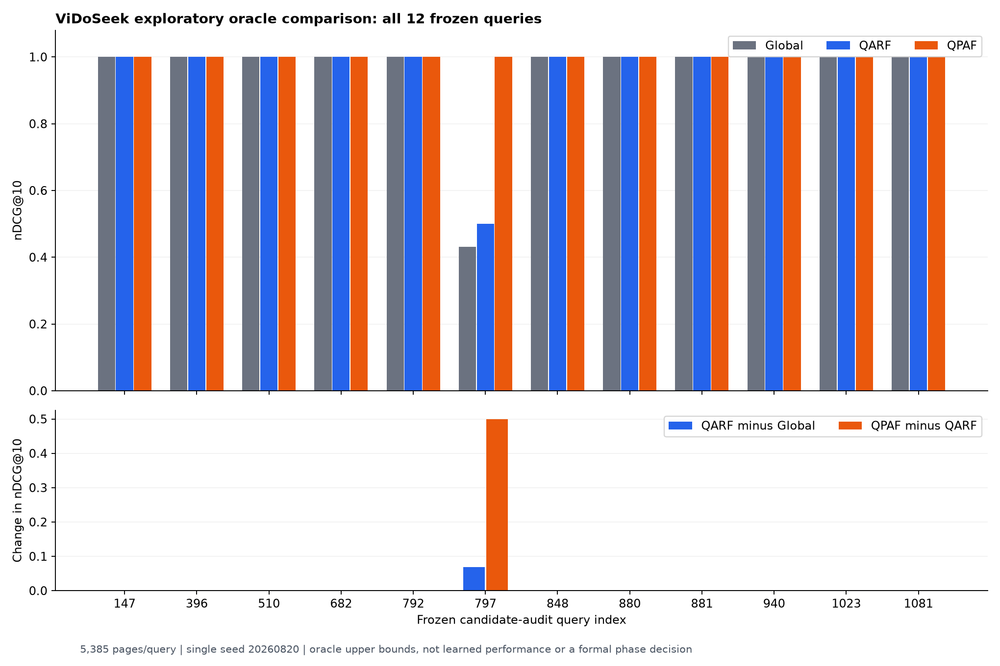

# ViDoSeek exploratory-12: verified Global / QARF / QPAF comparison

**Completed and independently verified: all 12 frozen queries, 5,385 pages/query (64,620 query-page pairs).** Four complete query results were inherited from the interrupted original attempt; the separately approved recovery computed the remaining eight. The original evidence was preserved.

These are relevance-informed oracle upper bounds on a small exploratory subset. They do not measure trained/deployable performance, represent the full 1,142-query discovery set, or pass/fail a formal Phase 1 gate.

## Mean retrieval quality

Single-seed study (seed=20260820). Global chooses one fixed W7 profile across these same 12 queries; QARF chooses per query; QPAF changes weights per page using the existing two-sweep coordinate search. ViDoRe remains outside this study.

| Method | Mean nDCG@10 |
| --- | ---: |
| Global | 0.952556 |
| QARF | 0.958333 |
| QPAF | 1.000000 |

## Paired gains and uncertainty

Query-bootstrap percentile 95% intervals use 10,000 resamples with seed 20260820. These intervals describe the fixed exploratory sample; they are not population proof or variance across independently trained seeds.

| Comparison | Mean change in nDCG@10 | Bootstrap 95% interval | Win / tie / loss |
| --- | ---: | --- | --- |
| QARF minus Global | 0.005777 | [0.000000, 0.017331] | 1 / 11 / 0 |
| QPAF minus QARF | 0.041667 | [0.000000, 0.125000] | 1 / 11 / 0 |

QPAF-minus-QARF positive-gain concentration (`top_5pct_gain_share`): 1.000000. With 12 queries, the top-5% calculation selects one query. A value of zero is also the implementation's convention when total positive gain is zero.

## Every selected query

| Audit index | Global | QARF | QPAF | QPAF minus QARF | Relevant pages | Origin |
| ---: | ---: | ---: | ---: | ---: | ---: | --- |
| 147 | 1.000000 | 1.000000 | 1.000000 | 0.000000 | 1 | Original checkpoint |
| 396 | 1.000000 | 1.000000 | 1.000000 | 0.000000 | 1 | Original checkpoint |
| 510 | 1.000000 | 1.000000 | 1.000000 | 0.000000 | 1 | Original checkpoint |
| 682 | 1.000000 | 1.000000 | 1.000000 | 0.000000 | 1 | Original checkpoint |
| 792 | 1.000000 | 1.000000 | 1.000000 | 0.000000 | 1 | Recovery computation |
| 797 | 0.430677 | 0.500000 | 1.000000 | 0.500000 | 1 | Recovery computation |
| 848 | 1.000000 | 1.000000 | 1.000000 | 0.000000 | 1 | Recovery computation |
| 880 | 1.000000 | 1.000000 | 1.000000 | 0.000000 | 1 | Recovery computation |
| 881 | 1.000000 | 1.000000 | 1.000000 | 0.000000 | 1 | Recovery computation |
| 940 | 1.000000 | 1.000000 | 1.000000 | 0.000000 | 1 | Recovery computation |
| 1023 | 1.000000 | 1.000000 | 1.000000 | 0.000000 | 1 | Recovery computation |
| 1081 | 1.000000 | 1.000000 | 1.000000 | 0.000000 | 1 | Recovery computation |

Full query IDs and recovery timings are in [query_comparison.csv](../../../artifacts/vidoseek_exploratory12_recovery_review/query_comparison.csv). The chart and table include every selected query without filtering by outcome.

## Execution and evidence

Recovery elapsed wall time: 6023.918 seconds. This includes only the new recovery invocation; it is not total compute across both attempts. Original query durations were not reconstructed from incomplete timing records. Reused-checkpoint validation time is not search runtime.

- [Independent integrity review](../../../artifacts/vidoseek_exploratory12_recovery_review/result_integrity_review.json): artifact and source hashes, approval/attempt/lineage, inherited checkpoint preservation, all query IDs/input hashes, all reconstructed ranking metrics, Global selection, and summary/bootstrap checks passed.
- [Complete recovery manifest](../../../runs/vidoseek_exploratory12_recovery_v1/run_manifest.json).
- [Original interruption audit](../../../artifacts/vidoseek_exploratory12_interruption_review_20260907/checkpoint_integrity_review.json).
- [Recovery execution scope](QPAF_EXPLORATORY12_RECOVERY_EXECUTION_REVIEW.md).

`phase1_decision=NOT_APPLICABLE_EXPLORATORY_SUBSET`. Frozen P1-02 remains BLOCKED. Full W7/W66, P1-03, training, and Modal/GPU were not opened by this result. No formal stop/go or learned-QPAF conclusion should be inferred from this subset alone.
