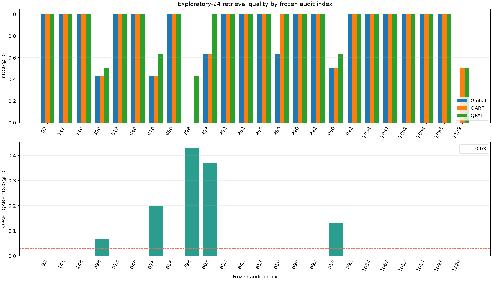

# ViDoSeek exploratory-24: verified Global / QARF / QPAF comparison

**Completed and independently verified: 24 frozen additional queries, 5,385 pages/query, and 129,240 query-page pairs.** The queries were sampled uniformly without replacement from the 1,130-query remainder before their page-level outcomes were known. They do not overlap the earlier exploratory-12 sample.

This is a relevance-informed oracle upper-bound study on a bounded exploratory subset. It is not trained or deployable performance, full-discovery evidence, W66 sensitivity, or a formal Phase 1 decision.

## Mean retrieval quality

Single-seed study (`20260820`). Global chooses one fixed W7 profile over these same 24 queries; QARF chooses one W7 profile per query; QPAF uses the unchanged two-sweep page-level coordinate search.

| Method | Mean nDCG@10 |
| --- | ---: |
| Global | 0.817634 |
| QARF | 0.853845 |
| QPAF | 0.903856 |

## Paired gains and uncertainty

Query-bootstrap percentile 95% intervals use 10,000 resamples with seed `20260820`. They describe this exploratory query sample and are not population proof or variance across training seeds.

| Comparison | Mean nDCG@10 change | Bootstrap 95% interval | Win / tie / loss |
| --- | ---: | --- | --- |
| QARF minus Global | 0.036211 | [0.000000, 0.093256] | 2 / 22 / 0 |
| QPAF minus QARF | 0.050011 | [0.008344, 0.101921] | 5 / 19 / 0 |

QPAF-minus-QARF positive-gain concentration (`top_5pct_gain_share`) is 0.666315. With 24 queries, the top-5% calculation selects two queries. QPAF changed only six of 129,240 page assignments across five queries; those top-ranked page changes were sufficient to improve nDCG@10.

## Every selected query

| Audit index | Global | QARF | QPAF | QPAF minus QARF | Changed pages |
| ---: | ---: | ---: | ---: | ---: | ---: |
| 92 | 1.000000 | 1.000000 | 1.000000 | 0.000000 | 0 |
| 141 | 1.000000 | 1.000000 | 1.000000 | 0.000000 | 0 |
| 148 | 1.000000 | 1.000000 | 1.000000 | 0.000000 | 0 |
| 398 | 0.430677 | 0.430677 | 0.500000 | 0.069323 | 1 |
| 513 | 1.000000 | 1.000000 | 1.000000 | 0.000000 | 0 |
| 640 | 1.000000 | 1.000000 | 1.000000 | 0.000000 | 0 |
| 676 | 0.430677 | 0.430677 | 0.630930 | 0.200253 | 2 |
| 686 | 1.000000 | 1.000000 | 1.000000 | 0.000000 | 0 |
| 798 | 0.000000 | 0.000000 | 0.430677 | 0.430677 | 1 |
| 803 | 0.630930 | 0.630930 | 1.000000 | 0.369070 | 1 |
| 832 | 1.000000 | 1.000000 | 1.000000 | 0.000000 | 0 |
| 842 | 1.000000 | 1.000000 | 1.000000 | 0.000000 | 0 |
| 855 | 1.000000 | 1.000000 | 1.000000 | 0.000000 | 0 |
| 889 | 0.630930 | 1.000000 | 1.000000 | 0.000000 | 0 |
| 890 | 1.000000 | 1.000000 | 1.000000 | 0.000000 | 0 |
| 892 | 1.000000 | 1.000000 | 1.000000 | 0.000000 | 0 |
| 950 | 0.500000 | 0.500000 | 0.630930 | 0.130930 | 1 |
| 992 | 1.000000 | 1.000000 | 1.000000 | 0.000000 | 0 |
| 1034 | 1.000000 | 1.000000 | 1.000000 | 0.000000 | 0 |
| 1067 | 1.000000 | 1.000000 | 1.000000 | 0.000000 | 0 |
| 1082 | 1.000000 | 1.000000 | 1.000000 | 0.000000 | 0 |
| 1084 | 1.000000 | 1.000000 | 1.000000 | 0.000000 | 0 |
| 1093 | 1.000000 | 1.000000 | 1.000000 | 0.000000 | 0 |
| 1129 | 0.000000 | 0.500000 | 0.500000 | 0.000000 | 0 |

Full query IDs and unrounded values are in [query_comparison.csv](../artifacts/vidoseek_exploratory24_review/query_comparison.csv). The chart and table include every frozen query without outcome filtering.

## Interpretation and next gate

This W7 exploratory sample clears the three continuation signals used for review: mean QPAF-minus-QARF gain is at least 0.03, its bootstrap lower bound is above zero, and top-5% gain share is below 0.90. It also stays above the 0.01 learned-QPAF stop threshold. The evidence is broader than exploratory-12, where one query supplied all gain, but 19 of 24 queries still tie and this sample cannot establish full-discovery behavior.

The next defensible action is a separate resource and protocol review for W66 sensitivity on the same frozen 24 queries. W66 execution is not authorized by this result. Full-discovery page-level CPU search is also impractical without a new compute design: this run took 8,700.394 seconds for 24 queries, about 2 hours 25 minutes, and that measured subset time must not be treated as a guaranteed linear full-corpus runtime.

## Execution and verification evidence

- [Tracked closeout receipt](../artifacts/vidoseek_exploratory24_review/closeout_receipt.json), which records the complete local run-manifest SHA-256 `0fcfbceee0e581240f241447abae1cb85cbb4f11cfee4f4d5343c2f81e06d9ee`. The full run directory remains local and Git-ignored.
- [Independent integrity review](../artifacts/vidoseek_exploratory24_review/result_integrity_review.json): 82 manifest artifacts, 50 checkpoint envelopes, 25 source snapshots, 960 raw ranking metrics, and 415 aggregate metric/delta comparisons passed.
- [Frozen sample and protocol](vidoseek_w7_exploratory24_proposal.json), query-list SHA-256 `95715b6a8c0c2d684b3a34e9130eca25ea641aafb62678f7daa764f0ab585f5b`.
- One local CPU worker/thread, one invocation, zero retries, Python 3.13.7; completed in 8,700.394 seconds under the 43,200-second cap. The result chart passed visual inspection.

`phase1_decision=NOT_APPLICABLE_EXPLORATORY_SUBSET`. Frozen P1-02 remains `BLOCKED`. Full W7/W66, P1-03, training, and Modal/GPU remain closed.
