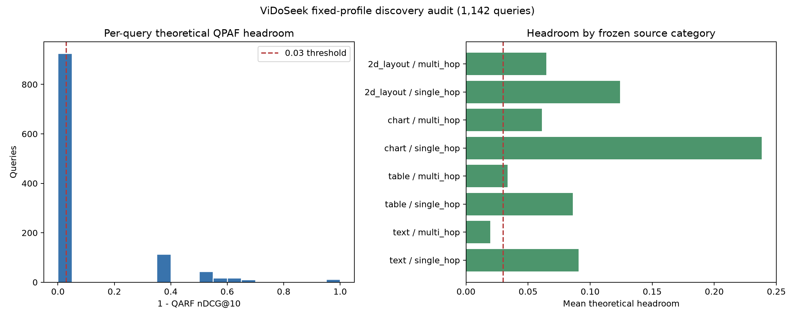

# ViDoSeek fixed-profile discovery audit: verified result

**COMPLETE AND INDEPENDENTLY VERIFIED.** The single approved local CPU invocation completed on 2026-09-08 in 561.485 seconds. It evaluated all 1,142 frozen ViDoSeek discovery queries against all 5,385 pages per query (6,149,670 query-page pairs) using the seven fixed W7 profiles.

This is a post-hoc fixed-profile headroom audit. It did not execute QPAF page-level coordinate search, W66, training, Modal/GPU, random query sampling, bootstrap resampling, or a formal Phase 1 decision.

## Verified retrieval metrics

Global selects one fixed profile across the full discovery population. QARF selects one of the same seven profiles per query using relevance-informed oracle selection.

| Method | Mean nDCG@10 | Recall@1 | Recall@3 | MRR@10 |
| --- | ---: | ---: | ---: | ---: |
| BM25 | 0.675342 | 0.489492 | 0.704904 | 0.615051 |
| Dense | 0.704603 | 0.537653 | 0.743433 | 0.652107 |
| Visual | 0.875138 | 0.756567 | 0.915937 | 0.840528 |
| Global | 0.875138 | 0.756567 | 0.915937 | 0.840528 |
| QARF | 0.908268 | 0.810858 | 0.948336 | 0.881248 |

The selected Global profile is visual-only `[0, 0, 1]`. QARF improves mean nDCG@10 over Global by 0.033129 using only query-level selection among the seven fixed profiles.

## Remaining theoretical headroom

For each query, `1 - nDCG@10(QARF)` is an absolute upper bound on any possible QPAF improvement over QARF. The verified mean bound is **0.091732**, above the 0.03 review threshold.

- Global is at the nDCG@10 ceiling for 864/1,142 queries (75.66%).
- QARF is at the ceiling for 926/1,142 queries (81.09%).
- Exactly 216 queries retain positive headroom; the same 216 have at least 0.03 headroom.
- The largest per-query bound is 1.0 because some covered queries have QARF nDCG@10 equal to zero.

This result means a mean QPAF gain of 0.03 is not mathematically ruled out on the frozen discovery inputs. It does not show that the existing QPAF search can attain that gain. The bound assumes a perfect page ranking for every query and is therefore deliberately optimistic.

## Source-category view

| Source category | Queries | QARF mean nDCG@10 | Mean theoretical headroom | QARF ceiling fraction |
| --- | ---: | ---: | ---: | ---: |
| 2D layout / multi-hop | 218 | 0.935163 | 0.064837 | 0.866972 |
| 2D layout / single-hop | 512 | 0.876021 | 0.123979 | 0.736328 |
| Chart / multi-hop | 141 | 0.938888 | 0.061112 | 0.893617 |
| Chart / single-hop | 16 | 0.761846 | 0.238154 | 0.687500 |
| Table / multi-hop | 119 | 0.966428 | 0.033572 | 0.932773 |
| Table / single-hop | 56 | 0.913938 | 0.086062 | 0.803571 |
| Text / multi-hop | 19 | 0.980575 | 0.019425 | 0.947368 |
| Text / single-hop | 61 | 0.909253 | 0.090747 | 0.803279 |

Chart/single-hop has the largest mean bound, but it contains only 16 queries. These categories are descriptive slices of the fixed discovery population, not independently powered hypothesis tests.

## Independent review evidence

The separate verifier checked 1,171 run-artifact hashes and all 1,142 checkpoint envelopes. It independently recomputed 32,012 metric values from all 6,149,670 raw score rows, then reconstructed Global/QARF selection, population means, ceiling counts, source counts, and the headroom decision. All checks passed.

- [Integrity review](../artifacts/vidoseek_fixed_profile_audit_review/result_integrity_review.json)
- [Per-query headroom table](../artifacts/vidoseek_fixed_profile_audit_review/query_headroom.csv)
- [Source summary](../artifacts/vidoseek_fixed_profile_audit_review/source_summary.csv)
- [Tracked closeout receipt](../artifacts/vidoseek_fixed_profile_audit_review/closeout_receipt.json), which records the local completion-manifest and execution-approval hashes. The full run directory remains local and Git-ignored.
- [Approved configuration](../configs/vidoseek_fixed_profile_audit_v1.json)

The chart was visually inspected after generation: axes, threshold line, source labels, population count, and plotted subgroup values agree with the verified tables. Review receipt SHA-256 is `9358ba32f0dd5015685efb34f007abb6bd59ec1ec66668bc6d39b08955eac176`; manifest SHA-256 is `7f58280aed8e9376e53adf4cfa8e527a0189ee6ad196df59d22706539ad8008e`.

## Next decision

The audit returns `HEADROOM_POSSIBLE_REVIEW_COMPUTE`. The next defensible step is to review and freeze a bounded page-level QPAF feasibility protocol, preferably the already proposed 24-query uniform sample from the 1,130-query remainder, before any new search. That sample must remain exploratory and be reported separately from the original 12-query pilot.

No further invocation is authorized by this result. Full W7/W66, training, P1-03, Modal/GPU, formal phase decisions, and changes to frozen P1-02 remain closed.
